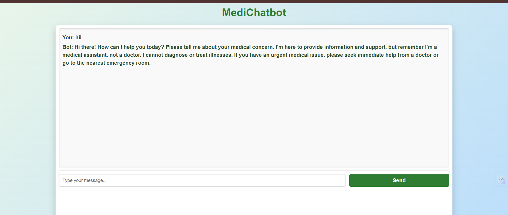
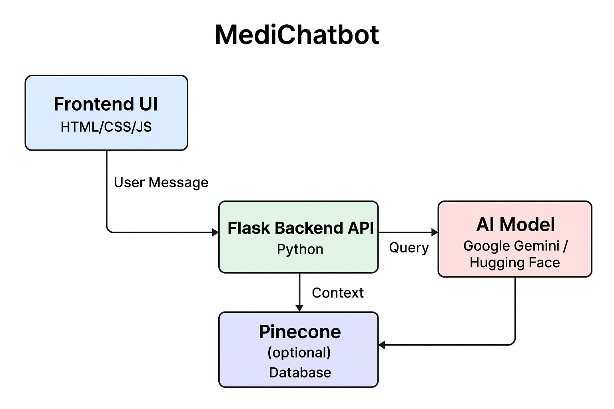

# 🩺 MediChatbot – AI-powered Medical Assistant


MediChatbot is an AI-powered medical information assistant built using **Flask** and the **Google Gemini API**.  
It provides detailed, accurate answers to general medical queries in real-time.

> **Disclaimer:** This chatbot is for **educational and informational purposes only**.  
> It is not intended to diagnose or treat any medical condition. Always consult a qualified healthcare professional for medical concerns.

---

## Features

- Real-time chatbot interface for user interaction  
- Uses Google Gemini API to generate accurate, well-structured answers  
- Pinecone Vector Database for storing and fetching medical reference data  
- Flask-based backend for API handling  
- Simple and responsive frontend using HTML, CSS, and JavaScript  

---

## Tech Stack

- **Backend:** Python (Flask)  
- **Frontend:** HTML, CSS, JavaScript  
- **AI Model:** Google Gemini API  
- **Database:** Pinecone Vector Database  
- **Environment:** Python virtual environment (`venv`)  

---

## Flow

**Step 1** → User sends query from **Frontend** (HTML/CSS/JavaScript)  
**Step 2** → **Flask Backend** receives and processes the query  
**Step 3** → Backend queries **Pinecone Database** to fetch related medical reference data  
**Step 4** → Retrieved context + user query sent to **Google Gemini API** for response generation  
**Step 5** → Final answer returned to **Frontend** and displayed to the user  

---

## Project Structure

```
medi-chatbot/
│
├── static/                # CSS, JS, Images
├── templates/             # HTML templates
│   └── chat.html
├── src/
│   └── prompt.py          # System prompt configuration
├── app.py                  # Main Flask application
├── requirements.txt        # Python dependencies
├── .env                    # API keys and environment variables
└── README.md               # Documentation
```

---

## Installation

### 1️⃣ Clone the Repository
```bash
git clone https://github.com/sohaibmd/medi-chatbot.git
cd medi-chatbot
```

### 2️⃣ Create & Activate a Virtual Environment
```bash
python -m venv myenv
# Mac/Linux
source myenv/bin/activate
# Windows
myenv\Scripts\activate
```

### 3️⃣ Install Dependencies
```bash
pip install -r requirements.txt
```

---

## Environment Variables

Create a `.env` file in the project root and add:

```env
GEMINI_API_KEY=your_google_gemini_api_key
PINECONE_API_KEY=your_pinecone_api_key
```

---

## Running the Application
```bash
python app.py
```
Your application will be available at:  
**http://127.0.0.1:8080**

---

## Application UI

### Chatbot Interface


## Architecture Diagram


